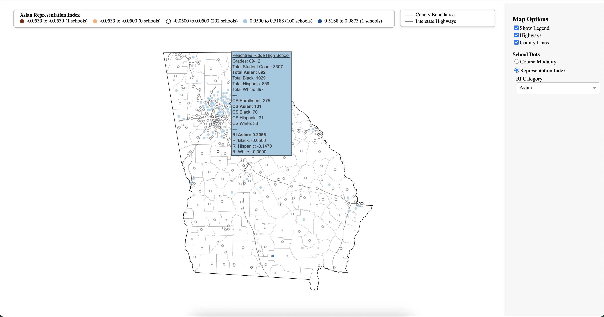
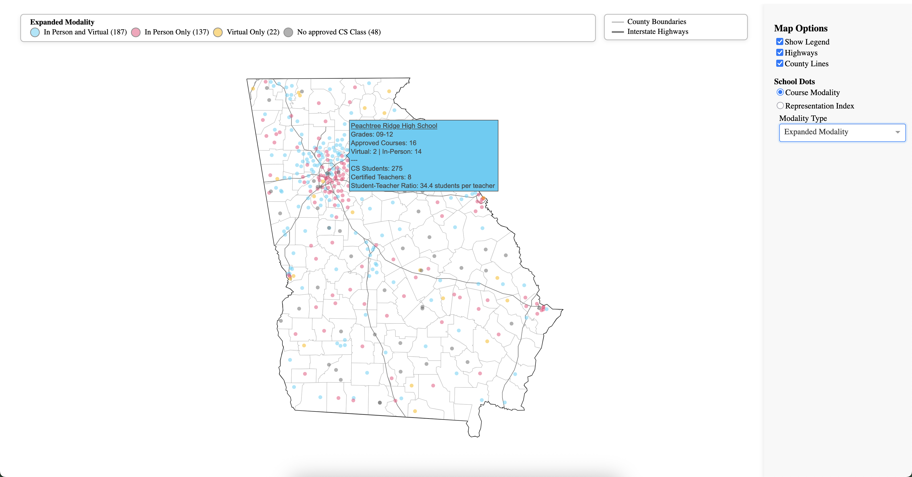

# CoSEA Dashboard

Dashboard that pulls data directly from the database to generate maps based on selected settings. Currently supports displaying Modality or RI dots based on selected category from dropdown.

Image displaying RI_Asian

Image displaying Expanded Modality

The legend is toggleable, as well as the different map options like highways and county lines.

To do:
- [ ] Add filtering for dots to show for example: only schools with extra teachers, or only schools that have above or below parity.
- [ ] Adding underlays from census data
- [ ] Implement search function that zooms in on and filters based on search terms like: Name, county, zip, school-district, courses